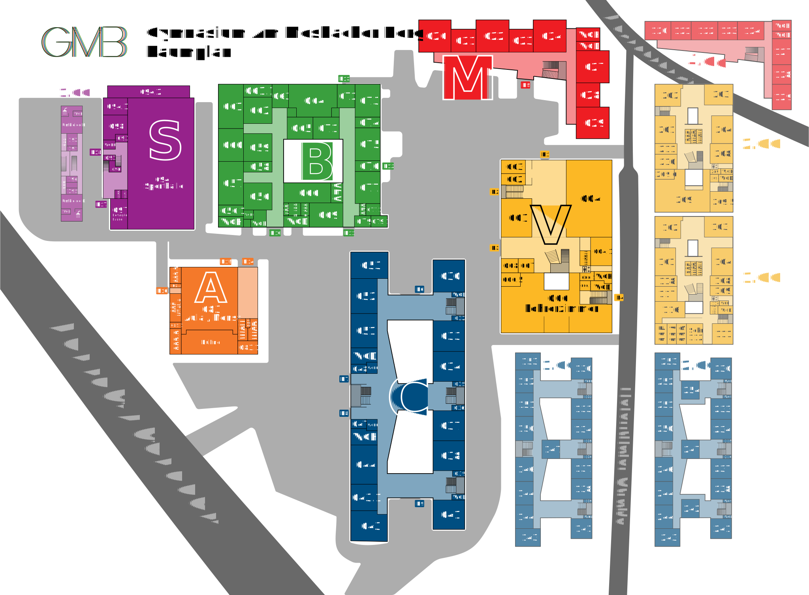

# GMB-Raumplan

Die Webseite für den Raumplan des Gymnasiums am Mosbacher Berg

## Automatisches Deployment

Der main Branch wird bei jedem Commit automatisch gebuildet und auf [raumplan.mosbacher-berg.de](https://raumplan.mosbacher-berg.de) hochgeladen.

