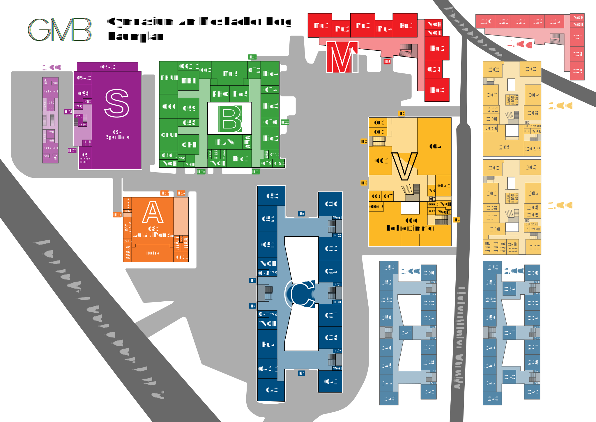

# GMB-Raumplan

Die Webseite für den Raumplan des [Gymnasiums am Mosbacher Berg Wiesbaden](https://mosbacher-berg.de)

Diese App wird auf [raumplan.mosbacher-berg.de](https://raumplan.mosbacher-berg.de) gehosted.

## Bearbeitung

Die Datei [`./map/GMB_MAP.svg`](./map/GMB_MAP.svg) ist die Raumplan datei. Sie wurde mit Inkscape erstellt und sollte auch mit Inkscape bearbeitet werden.

Nach Bearbeitung der `GMB_MAP.svg`-Datei sollte der command `pnpm run generateMapFiles` ausgeführt werden.

Dieser exportiert die richtigen Formate in [`./src/assets/map/`](./src/assets/files/)

Im Verzeichnis [`./map/`](./map/) sind außerdem weitere Ressourcen, die zur Bearbeitung des Raumplans dienen.

### SVG Elemtstruktur

Jedes Gebäude ist eine Gruppe mit der Klasse `building`. Der Gebäude-Buchstabe sollte in diesem Gruppenelement durch das XML-Attribut `building-letter`, der Gebäude-Name durch das XML-Attribut `building-name` festgelegt werden. Diese bleiben auch nach dem Inkscape-Export erhalten und werden von der App benutzt, um die Gebäude zuzuordenen.

In jedem Gebäude muss sich ein Outline-Objekt (entweder \<Rect> oder \<Path>) Element mit der Klasse `buildingOutline` befinden.

Jede Gebäude-Gruppe sollte eine weitere Gruppe mit der Klasse `roomContainer` sein, die die Räume beinhaltet.

Jeder Raum besteht aus einer Gruppe mit der Klasse `room`. Diese beinhaltet ein \<Rect> oder \<Path> Element für den Boden und ein oder mehere Textelemente. Das erste Textelement wird als Anzeigename für die Suchfunktion verwedet, wobei man nach allen Textelementen suchen kann.

## Automatisches Deployment

Der main Branch wird bei jedem Commit automatisch gebuildet und auf [raumplan.mosbacher-berg.de](https://raumplan.mosbacher-berg.de) hochgeladen.

## Raumplan

